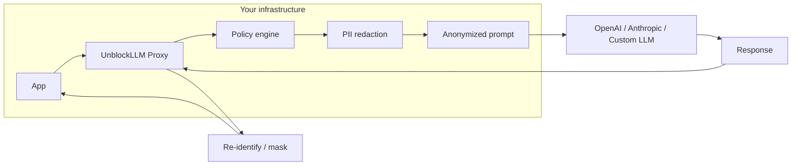
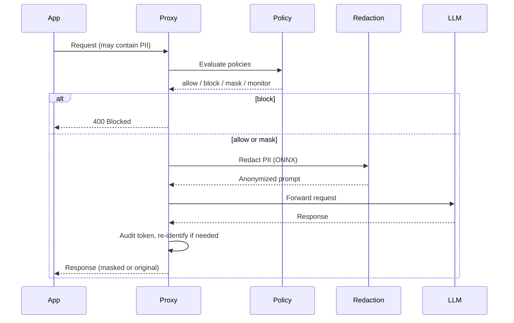
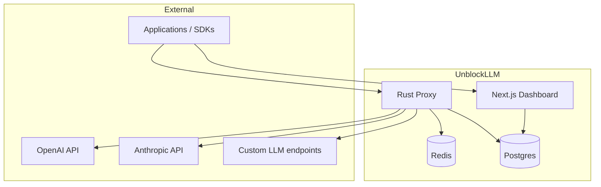

# UnblockLLM Architecture

Zero-trust privacy proxy for LLMs. Traffic flows through a local proxy that redacts PII, enforces policies, and audits every token. PII never leaves your infrastructure unencrypted.

## Data flow (high level)



**Path:** Local PII redaction (ONNX) → anonymized prompt → LLM → response → re-identify → return to client.

## Request lifecycle



## System context



- **Proxy:** TLS-terminated at load balancer; handles auth, policy, redaction, audit, and forwarding.
- **Dashboard:** Policy and key management; audit log views; runs behind same LB.
- **Redis:** Caching / rate limits (optional); if unreachable and configured, proxy returns 503 (block mode).
- **Postgres:** Audit logs; created by proxy at startup; optional retention migration.

## Repository structure

```
unblockllm/
  crates/           # Rust core (proxy, ONNX integration)
  python/           # Python SDK, benchmark, CLI
  apps/             # Next.js dashboard & landing
  proto/            # Protobuf schemas (internal)
  .github/workflows # CI/CD
  docs/             # Architecture, deployment, security
```

## Key properties

- **PII never leaves local infrastructure unencrypted.** Redaction happens before egress.
- **Target overhead:** &lt;20ms (mask + unmask).
- **Compliance:** GDPR, HIPAA, SOC2-ready (metadata-only audit).
- **Actions:** Block, mask, or monitor PII per policy; full token-level audit log.

## Related docs

- [Deployment](DEPLOYMENT.md) — TLS, secrets, Redis, audit retention, backup/restore.
- [Local development](LOCAL_DEVELOPMENT.md) — Run proxy and dashboard locally.
- [Security model](SECURITY_MODEL.md) — Threat model and constraints.
